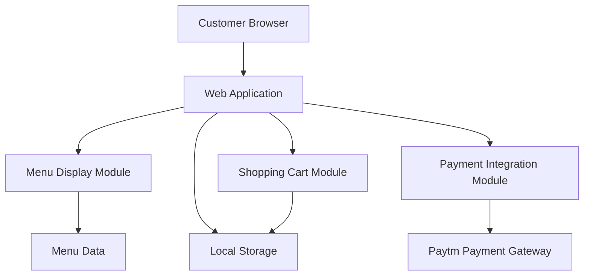
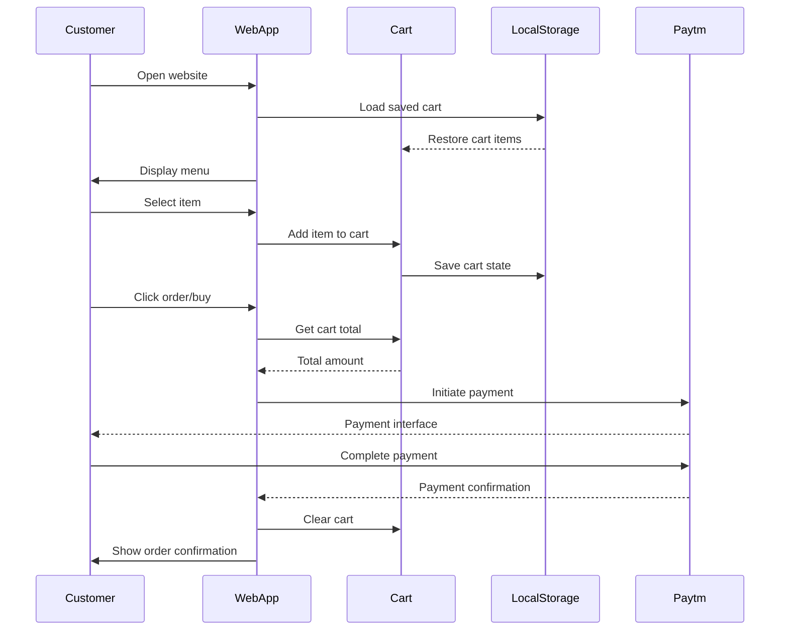

# Design Document: Restaurant Ordering Website

## Overview

The restaurant ordering website is a web-based application that enables customers to browse menu items, add items to their cart, and complete purchases through integrated payment systems. Built with HTML, CSS, and JavaScript, the system provides a responsive interface that works seamlessly on both mobile and desktop devices. The application focuses on simplicity and speed, allowing customers to quickly select food items (pizza, burger, rice) and beverages (water), then proceed to payment through Paytm integration. The architecture is designed as a client-side single-page application with potential for future enhancements including user authentication, order tracking, and additional payment gateways.

## Architecture



The system follows a modular client-side architecture where:
- Menu Display Module handles rendering of available items
- Shopping Cart Module manages item selection and cart state
- Payment Integration Module interfaces with Paytm
- Local Storage persists cart data across sessions

## Main Algorithm/Workflow



## Components and Interfaces

### Component 1: MenuManager

**Purpose**: Manages menu items display and filtering

**Interface**:
```javascript
class MenuManager {
  constructor(menuData)
  renderMenu()
  filterByCategory(category)
  getItemById(itemId)
}
```

**Responsibilities**:
- Load and display menu items
- Handle category filtering
- Provide item details on demand
- Update UI when menu changes

### Component 2: ShoppingCart

**Purpose**: Manages cart state and operations

**Interface**:
```javascript
class ShoppingCart {
  constructor()
  addItem(item, quantity)
  removeItem(itemId)
  updateQuantity(itemId, quantity)
  getTotal()
  getItems()
  clear()
  saveToStorage()
  loadFromStorage()
}
```

**Responsibilities**:
- Add/remove items from cart
- Calculate totals
- Persist cart state to local storage
- Validate cart operations

### Component 3: PaymentHandler

**Purpose**: Handles payment gateway integration

**Interface**:
```javascript
class PaymentHandler {
  constructor(config)
  initiatePayment(amount, orderDetails)
  handlePaymentCallback(response)
  validatePayment(transactionId)
}
```

**Responsibilities**:
- Initialize Paytm payment flow
- Handle payment responses
- Validate transaction status
- Manage payment errors

### Component 4: UIController

**Purpose**: Manages user interface updates and interactions

**Interface**:
```javascript
class UIController {
  constructor(menuManager, cart, paymentHandler)
  init()
  updateCartDisplay()
  showNotification(message, type)
  toggleCartModal()
  handleCheckout()
}
```

**Responsibilities**:
- Coordinate between components
- Update UI based on state changes
- Handle user interactions
- Display notifications and modals

## Data Models

### Model 1: MenuItem

```javascript
interface MenuItem {
  id: string
  name: string
  description: string
  category: 'food' | 'beverage'
  price: number
  image: string
  available: boolean
}
```

**Validation Rules**:
- id must be unique and non-empty
- name must be non-empty string
- price must be positive number
- category must be either 'food' or 'beverage'

### Model 2: CartItem

```javascript
interface CartItem {
  menuItem: MenuItem
  quantity: number
  subtotal: number
}
```

**Validation Rules**:
- quantity must be positive integer
- subtotal must equal menuItem.price * quantity
- menuItem must be valid MenuItem object

### Model 3: Order

```javascript
interface Order {
  orderId: string
  items: CartItem[]
  total: number
  timestamp: Date
  paymentStatus: 'pending' | 'completed' | 'failed'
  transactionId: string | null
}
```

**Validation Rules**:
- orderId must be unique
- items array must not be empty
- total must match sum of all item subtotals
- paymentStatus must be valid enum value

### Model 4: PaymentConfig

```javascript
interface PaymentConfig {
  merchantId: string
  merchantKey: string
  website: string
  industryType: string
  channelId: string
  callbackUrl: string
}
```

**Validation Rules**:
- All fields must be non-empty strings
- callbackUrl must be valid URL format

## Key Functions with Formal Specifications

### Function 1: addItem()

```javascript
function addItem(item, quantity)
```

**Preconditions:**
- `item` is a valid MenuItem object
- `item.available === true`
- `quantity` is a positive integer
- `quantity <= 99` (maximum order quantity)

**Postconditions:**
- If item exists in cart: quantity is incremented
- If item is new: new CartItem is added to cart
- Cart total is recalculated
- Cart state is saved to localStorage
- UI is updated to reflect changes

**Loop Invariants:** N/A

### Function 2: calculateTotal()

```javascript
function calculateTotal()
```

**Preconditions:**
- Cart items array is defined (may be empty)
- All CartItem objects have valid subtotal values

**Postconditions:**
- Returns non-negative number
- Return value equals sum of all item subtotals
- No mutations to cart state

**Loop Invariants:**
- For each iteration: accumulated total is non-negative
- All processed items have been included in sum

### Function 3: initiatePayment()

```javascript
function initiatePayment(amount, orderDetails)
```

**Preconditions:**
- `amount` is positive number
- `orderDetails` contains valid Order object
- Payment configuration is properly initialized
- Cart is not empty

**Postconditions:**
- Paytm payment form is generated and submitted
- User is redirected to Paytm payment page
- Order is saved with 'pending' status
- Cart remains unchanged until payment confirmation

**Loop Invariants:** N/A

### Function 4: validateCart()

```javascript
function validateCart()
```

**Preconditions:**
- Cart object is initialized

**Postconditions:**
- Returns boolean indicating cart validity
- `true` if and only if: cart is not empty AND all items are available AND all quantities are valid
- No side effects on cart state

**Loop Invariants:**
- All previously validated items remain valid during iteration

## Algorithmic Pseudocode

### Main Order Processing Algorithm

```javascript
// Main workflow algorithm
async function processOrder() {
  // Precondition: Cart is validated and not empty
  if (!validateCart()) {
    throw new Error('Invalid cart state')
  }
  
  // Step 1: Generate order ID
  const orderId = generateOrderId()
  
  // Step 2: Calculate final total
  const total = calculateTotal()
  
  // Step 3: Create order object
  const order = {
    orderId: orderId,
    items: cart.getItems(),
    total: total,
    timestamp: new Date(),
    paymentStatus: 'pending',
    transactionId: null
  }
  
  // Step 4: Save order to localStorage
  saveOrder(order)
  
  // Step 5: Initiate payment
  try {
    await initiatePayment(total, order)
    // Payment gateway will redirect user
  } catch (error) {
    order.paymentStatus = 'failed'
    updateOrder(order)
    throw error
  }
  
  // Postcondition: Order is created and payment initiated
}
```

**Preconditions:**
- Cart contains at least one item
- All cart items are available
- Payment configuration is valid

**Postconditions:**
- Order is created with unique ID
- Order is saved to localStorage
- Payment process is initiated
- User is redirected to payment gateway

### Cart Management Algorithm

```javascript
// Add item to cart with quantity management
function addItemToCart(menuItem, quantity) {
  // Precondition: menuItem is valid and available
  if (!menuItem || !menuItem.available) {
    return false
  }
  
  if (quantity <= 0 || quantity > 99) {
    return false
  }
  
  // Check if item already exists in cart
  const existingItem = cart.items.find(item => item.menuItem.id === menuItem.id)
  
  if (existingItem) {
    // Update existing item quantity
    const newQuantity = existingItem.quantity + quantity
    
    if (newQuantity > 99) {
      return false
    }
    
    existingItem.quantity = newQuantity
    existingItem.subtotal = existingItem.menuItem.price * newQuantity
  } else {
    // Add new item to cart
    const cartItem = {
      menuItem: menuItem,
      quantity: quantity,
      subtotal: menuItem.price * quantity
    }
    cart.items.push(cartItem)
  }
  
  // Save cart state
  saveCartToStorage()
  
  // Update UI
  updateCartDisplay()
  
  return true
  
  // Postcondition: Item is added/updated in cart and persisted
}
```

**Preconditions:**
- menuItem is valid MenuItem object
- menuItem.available is true
- quantity is between 1 and 99

**Postconditions:**
- Cart contains the item with correct quantity
- Cart state is saved to localStorage
- UI reflects updated cart
- Returns true on success, false on failure

**Loop Invariants:**
- Cart integrity maintained throughout operation

### Payment Callback Handler Algorithm

```javascript
// Handle payment gateway callback
function handlePaymentCallback(response) {
  // Precondition: response contains transaction data
  const { orderId, transactionId, status, amount } = response
  
  // Step 1: Retrieve order from storage
  const order = getOrderById(orderId)
  
  if (!order) {
    throw new Error('Order not found')
  }
  
  // Step 2: Validate transaction amount
  if (amount !== order.total) {
    order.paymentStatus = 'failed'
    updateOrder(order)
    return { success: false, message: 'Amount mismatch' }
  }
  
  // Step 3: Update order based on payment status
  if (status === 'TXN_SUCCESS') {
    order.paymentStatus = 'completed'
    order.transactionId = transactionId
    updateOrder(order)
    
    // Clear cart
    cart.clear()
    saveCartToStorage()
    
    return { success: true, message: 'Payment successful', order: order }
  } else {
    order.paymentStatus = 'failed'
    updateOrder(order)
    
    return { success: false, message: 'Payment failed' }
  }
  
  // Postcondition: Order status updated and cart cleared on success
}
```

**Preconditions:**
- response contains valid payment callback data
- Order exists in localStorage
- Transaction amount matches order total

**Postconditions:**
- Order status is updated to 'completed' or 'failed'
- If successful: cart is cleared and transaction ID is saved
- If failed: order remains with failed status
- Returns result object with success status

## Example Usage

```javascript
// Example 1: Initialize application
const menuData = [
  { id: '1', name: 'Pizza', description: 'Cheese pizza', category: 'food', price: 299, image: 'pizza.jpg', available: true },
  { id: '2', name: 'Burger', description: 'Veg burger', category: 'food', price: 149, image: 'burger.jpg', available: true },
  { id: '3', name: 'Rice', description: 'Fried rice', category: 'food', price: 199, image: 'rice.jpg', available: true },
  { id: '4', name: 'Water', description: 'Mineral water', category: 'beverage', price: 20, image: 'water.jpg', available: true }
]

const menuManager = new MenuManager(menuData)
const cart = new ShoppingCart()
const paymentHandler = new PaymentHandler({
  merchantId: 'YOUR_MERCHANT_ID',
  merchantKey: 'YOUR_MERCHANT_KEY',
  website: 'WEBSTAGING',
  industryType: 'Retail',
  channelId: 'WEB',
  callbackUrl: 'https://yourwebsite.com/payment-callback'
})
const uiController = new UIController(menuManager, cart, paymentHandler)

uiController.init()

// Example 2: Add items to cart
const pizza = menuManager.getItemById('1')
cart.addItem(pizza, 2)

const water = menuManager.getItemById('4')
cart.addItem(water, 1)

// Example 3: Process checkout
document.getElementById('checkout-btn').addEventListener('click', async () => {
  if (!cart.validateCart()) {
    uiController.showNotification('Cart is empty or invalid', 'error')
    return
  }
  
  try {
    await processOrder()
  } catch (error) {
    uiController.showNotification('Order failed: ' + error.message, 'error')
  }
})

// Example 4: Handle payment callback
window.addEventListener('load', () => {
  const urlParams = new URLSearchParams(window.location.search)
  
  if (urlParams.has('orderId')) {
    const response = {
      orderId: urlParams.get('orderId'),
      transactionId: urlParams.get('transactionId'),
      status: urlParams.get('status'),
      amount: parseFloat(urlParams.get('amount'))
    }
    
    const result = handlePaymentCallback(response)
    
    if (result.success) {
      uiController.showNotification('Order placed successfully!', 'success')
    } else {
      uiController.showNotification('Payment failed. Please try again.', 'error')
    }
  }
})
```

## Correctness Properties

### Property 1: Cart Consistency
```javascript
// For all operations on cart:
// ∀ cart operations: sum(item.subtotal) === cart.total
function verifyCartConsistency(cart) {
  const calculatedTotal = cart.items.reduce((sum, item) => sum + item.subtotal, 0)
  return calculatedTotal === cart.total
}
```

### Property 2: Item Availability
```javascript
// All items in cart must be available:
// ∀ item ∈ cart.items: item.menuItem.available === true
function verifyItemAvailability(cart, menuManager) {
  return cart.items.every(cartItem => {
    const menuItem = menuManager.getItemById(cartItem.menuItem.id)
    return menuItem && menuItem.available
  })
}
```

### Property 3: Quantity Bounds
```javascript
// All quantities must be within valid range:
// ∀ item ∈ cart.items: 1 <= item.quantity <= 99
function verifyQuantityBounds(cart) {
  return cart.items.every(item => item.quantity >= 1 && item.quantity <= 99)
}
```

### Property 4: Payment Amount Integrity
```javascript
// Payment amount must match cart total:
// ∀ payment: payment.amount === cart.total
function verifyPaymentAmount(paymentAmount, cart) {
  return paymentAmount === cart.total
}
```

### Property 5: Order Uniqueness
```javascript
// All order IDs must be unique:
// ∀ order1, order2 ∈ orders: order1.orderId !== order2.orderId
function verifyOrderUniqueness(orders) {
  const orderIds = orders.map(order => order.orderId)
  return new Set(orderIds).size === orderIds.length
}
```

## Error Handling

### Error Scenario 1: Empty Cart Checkout

**Condition**: User attempts to checkout with empty cart
**Response**: Display error notification "Your cart is empty. Please add items before checkout."
**Recovery**: User remains on menu page to add items

### Error Scenario 2: Item Unavailable

**Condition**: User tries to add unavailable item to cart
**Response**: Display error notification "This item is currently unavailable."
**Recovery**: Item is not added to cart, user can select other items

### Error Scenario 3: Payment Gateway Failure

**Condition**: Paytm gateway fails to initialize or times out
**Response**: Display error notification "Payment gateway unavailable. Please try again later."
**Recovery**: Order remains in pending state, user can retry payment

### Error Scenario 4: Payment Callback Failure

**Condition**: Payment callback returns error or invalid data
**Response**: Mark order as failed, display error message
**Recovery**: User can create new order and retry payment

### Error Scenario 5: Local Storage Full

**Condition**: Browser local storage quota exceeded
**Response**: Display warning "Storage full. Cart may not be saved."
**Recovery**: Cart works in memory for current session

### Error Scenario 6: Network Disconnection

**Condition**: User loses internet connection during checkout
**Response**: Display error "Network error. Please check your connection."
**Recovery**: Order data preserved in localStorage, user can retry when online

## Testing Strategy

### Unit Testing Approach

Test each component in isolation using Jest or similar framework:

**MenuManager Tests**:
- Test menu rendering with various data sets
- Test category filtering functionality
- Test item retrieval by ID
- Test handling of empty menu data

**ShoppingCart Tests**:
- Test adding items (new and existing)
- Test removing items
- Test quantity updates
- Test total calculation
- Test localStorage persistence
- Test cart validation

**PaymentHandler Tests**:
- Test payment initialization with valid config
- Test payment callback handling (success/failure)
- Test transaction validation
- Test error handling for invalid responses

**UIController Tests**:
- Test UI updates on cart changes
- Test notification display
- Test modal toggling
- Test checkout flow coordination

### Property-Based Testing Approach

Use fast-check library for property-based testing:

**Property Test Library**: fast-check

**Property Test 1: Cart Total Calculation**
```javascript
// Property: Cart total always equals sum of item subtotals
fc.assert(
  fc.property(
    fc.array(fc.record({
      price: fc.integer({ min: 1, max: 1000 }),
      quantity: fc.integer({ min: 1, max: 99 })
    })),
    (items) => {
      const cart = new ShoppingCart()
      items.forEach(item => {
        cart.addItem({ id: Math.random().toString(), price: item.price }, item.quantity)
      })
      const expectedTotal = items.reduce((sum, item) => sum + (item.price * item.quantity), 0)
      return cart.getTotal() === expectedTotal
    }
  )
)
```

**Property Test 2: Quantity Bounds**
```javascript
// Property: Cart never accepts quantities outside valid range
fc.assert(
  fc.property(
    fc.integer(),
    (quantity) => {
      const cart = new ShoppingCart()
      const item = { id: '1', price: 100, available: true }
      const result = cart.addItem(item, quantity)
      
      if (quantity >= 1 && quantity <= 99) {
        return result === true
      } else {
        return result === false
      }
    }
  )
)
```

**Property Test 3: Order ID Uniqueness**
```javascript
// Property: Generated order IDs are always unique
fc.assert(
  fc.property(
    fc.integer({ min: 100, max: 1000 }),
    (count) => {
      const orderIds = []
      for (let i = 0; i < count; i++) {
        orderIds.push(generateOrderId())
      }
      return new Set(orderIds).size === orderIds.length
    }
  )
)
```

### Integration Testing Approach

Test component interactions and workflows:

**Integration Test 1: Complete Order Flow**
- Initialize all components
- Add items to cart
- Verify cart state
- Initiate checkout
- Mock payment gateway response
- Verify order creation and cart clearing

**Integration Test 2: Cart Persistence**
- Add items to cart
- Simulate page reload
- Verify cart state restored from localStorage
- Verify UI reflects restored state

**Integration Test 3: Payment Callback Flow**
- Create order
- Simulate payment gateway callback
- Verify order status update
- Verify cart clearing on success
- Verify UI updates

## Performance Considerations

**Page Load Optimization**:
- Lazy load images using intersection observer
- Minify and bundle JavaScript/CSS files
- Use CDN for static assets
- Implement service worker for offline capability

**Rendering Performance**:
- Use virtual scrolling for large menu lists
- Debounce search/filter operations
- Minimize DOM manipulations
- Use CSS transforms for animations

**Storage Optimization**:
- Limit localStorage usage to essential data
- Implement data expiration for old orders
- Compress stored data if needed

**Network Optimization**:
- Cache menu data in localStorage
- Implement retry logic for failed requests
- Use optimistic UI updates

## Security Considerations

**Payment Security**:
- Never store payment credentials in browser
- Use HTTPS for all payment communications
- Validate all payment callbacks server-side
- Implement CSRF protection for payment forms

**Data Validation**:
- Sanitize all user inputs
- Validate data types and ranges
- Prevent XSS attacks through proper escaping
- Validate payment amounts server-side

**Storage Security**:
- Don't store sensitive data in localStorage
- Implement data encryption for sensitive information
- Clear sensitive data after use

**Future Enhancements**:
- Implement server-side order validation
- Add rate limiting for API calls
- Implement user authentication with secure tokens
- Add order verification system

## Dependencies

**Core Technologies**:
- HTML5
- CSS3 (with Flexbox/Grid for responsive layout)
- JavaScript (ES6+)

**Payment Integration**:
- Paytm Payment Gateway SDK
- Paytm Merchant API

**Optional Libraries** (for enhanced functionality):
- LocalForage (enhanced localStorage with fallbacks)
- Day.js (date/time handling)
- Fast-check (property-based testing)
- Jest (unit testing)

**Development Tools**:
- Webpack or Vite (bundling)
- Babel (transpilation for older browsers)
- ESLint (code quality)
- Prettier (code formatting)

**Future Dependencies** (for planned enhancements):
- JWT library (authentication)
- WebSocket library (real-time order tracking)
- Additional payment gateway SDKs (Razorpay, Stripe)
